# Analyse du mix énergétique français — Power BI

Ce projet de groupe effectué au cours de ma formation de Data Analyst présente une analyse de la **production et consommation d'énergie en France** sur la période 2013–2024, réalisée avec **Power BI**. Il s'articule autour de trois rapports complémentaires, couvrant les dimensions nationales, régionales et météorologiques de la transition énergétique.

Les données utilisées proviennent de sources publiques (ODRE) et portent sur la production par filière (nucléaire, hydraulique, éolien, solaire, thermique, bioénergies), la consommation nationale et régionale, ainsi que les facteurs météorologiques associés.

---

## Structure du projet

```
├── Images/                      # Captures des visuels individuels
├── Rapport_Projet_Energie.pdf   # Vue d'ensemble des rapports
└── README.md
```

---

## Rapport 1 — Analyse globale du mix énergétique national

> **Problématique : Quelle est la production et consommation française moyenne annuelle ? Quelle est la part des différentes filières ? Quel a été le taux de couverture au fil des années ?**


---

### KPI — Production et consommation moyennes annuelles

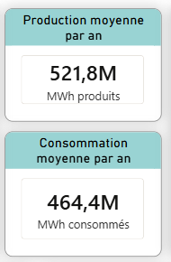

Ces deux indicateurs affichent les moyennes nationales sur la période 2013–2024 : **521,8M MWh produits** contre **464,4M MWh consommés**. La France produit globalement plus qu'elle ne consomme, ce qui lui confère une certaine autonomie énergétique — mais ce solde positif masque des disparités importantes selon les années.

---

### Répartition des filières — Part de production des différentes énergies en France

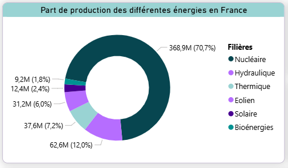

Ce graphique en anneau illustre la structure du mix énergétique français sur la période étudiée. Le **nucléaire représente 70,7% de la production totale** (368,9M MWh), confirmant la dépendance historique de la France à cette filière. L'hydraulique arrive en deuxième position (12%), suivi de l'éolien (7,2%), du thermique (6%) et du solaire (2,4%). Ce visuel met en perspective le poids relatif de chaque source et souligne la marge de progression des ENR dans le mix national.

---

### Évolution de la production d'ENR (2013–2024)

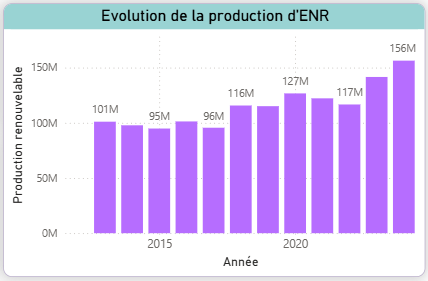

Ce graphique en barres retrace l'évolution annuelle de la production d'énergies renouvelables. On observe une tendance générale à la hausse, avec une production passant de **101M MWh en 2013 à 156M MWh en 2024**, malgré quelques années de légère baisse (2014–2015, 2022–2023). Cette progression reflète les investissements croissants dans les infrastructures renouvelables sur la dernière décennie.

---

### Taux de couverture en France de 2013 à 2024

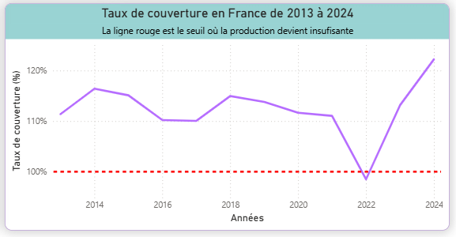

Ce graphique suit le rapport entre production et consommation nationales année par année. La **ligne rouge matérialise le seuil critique de 100%** : en dessous, la France ne couvre plus ses propres besoins. On constate que ce seuil a été frôlé en **2022**, année marquée par des arrêts massifs de réacteurs nucléaires pour maintenance et problèmes de corrosion. C'est le principal signal de risque identifié dans cette analyse.

---

## Rapport 2 — Analyse régionale avec indicateur démographique

> **Problématique : Quelles régions sont indépendantes énergétiquement ? Dans quelles régions les ENR sont-elles à développer ? La densité de population influence-t-elle la production et la consommation ?**


---

### Répartition des productions renouvelables/non-renouvelables par région

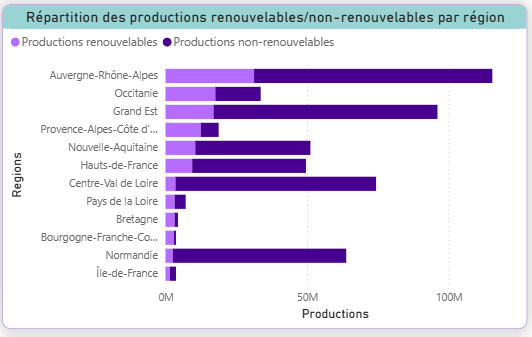

Ce diagramme compare pour chaque région française la part de production renouvelable versus non-renouvelable. **Auvergne-Rhône-Alpes et Grand Est dominent** grâce à leur production nucléaire, tandis que des régions comme la Bretagne ou Bourgogne-Franche-Comté affichent des volumes globaux faibles. Ce visuel oriente la réflexion sur les territoires prioritaires pour le développement des ENR.

---

### KPI — Top 3 des productions de la région Auvergne-Rhône-Alpes

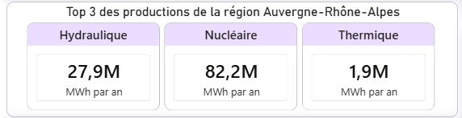

Ces trois indicateurs mettent en avant les principales sources de production de la région Auvergne-Rhône-Alpes : le **nucléaire en tête avec 82,2M MWh/an**, suivi de l'hydraulique (27,9M MWh/an) et du thermique (1,9M MWh/an). Cette région est la première productrice d'énergie en France, avec un mix qui combine puissance nucléaire et fort potentiel hydraulique lié au relief alpin.

---

### Part des productions d'ENR dans le mix énergétique d'Auvergne-Rhône-Alpes

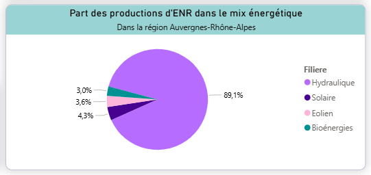

Ce graphique en secteurs détaille la composition renouvelable du mix énergétique régional. L'**hydraulique y représente 89,1% des ENR produites**, confirmant l'avantage géographique de la région. Le solaire (4,3%), l'éolien (3,6%) et les bioénergies (3%) restent marginaux, ce qui indique un potentiel de diversification encore peu exploité.

---

### KPI — Productions vs consommation moyenne par année

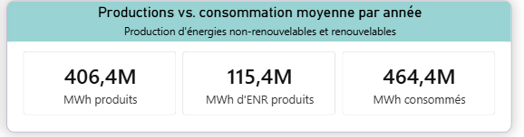

Ces trois indicateurs synthétisent l'équilibre énergétique national en distinguant production conventionnelle (406,4M MWh), production ENR (115,4M MWh) et consommation totale (464,4M MWh). Ils rappellent que malgré la croissance des renouvelables, ceux-ci ne couvrent à eux seuls qu'environ **25% de la consommation nationale**.

---

## Rapport 3 — Analyse en fonction des données météorologiques

> **Problématique : Les ENR sont-elles dépendantes des conditions météorologiques ? Quelle est leur évolution sur la période ? Peut-on constater une progression significative ?**


---

### Évolution de la part des ENR dans la production totale : 2013 vs 2024

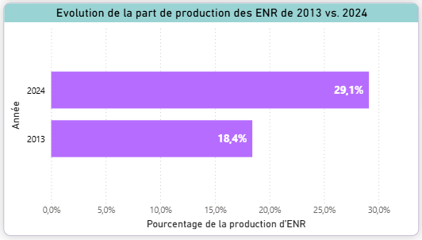

Ce graphique comparatif met en regard les parts des ENR dans la production totale en **2013 (18,4%)** et en **2024 (29,1%)**. La progression de près de 11 points en 10 ans témoigne d'une montée en puissance significative des renouvelables, mais souligne aussi que plus de 70% de la production reste non-renouvelable — laissant une large marge de progression pour atteindre les objectifs climatiques nationaux et européens.

---

### Production énergétique selon la météo — Filtre Hydraulique

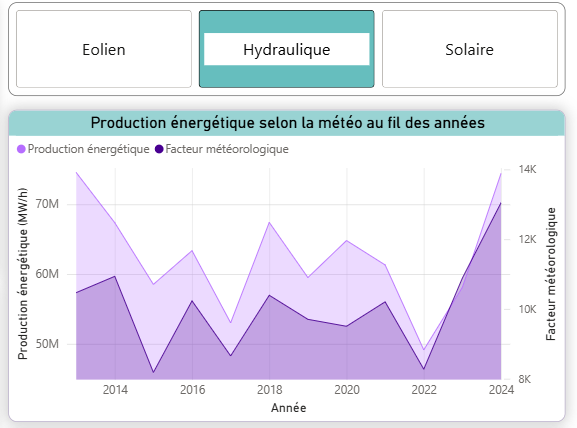

Ce visuel interactif croise l'évolution de la production hydraulique avec le **facteur météorologique associé (pluviométrie)**. On observe une forte corrélation entre les deux courbes, notamment un creux marqué en 2022 correspondant à la sécheresse historique qui a sévèrement impacté la production hydraulique française cette année-là.

---

### Production énergétique selon la météo — Filtre Solaire

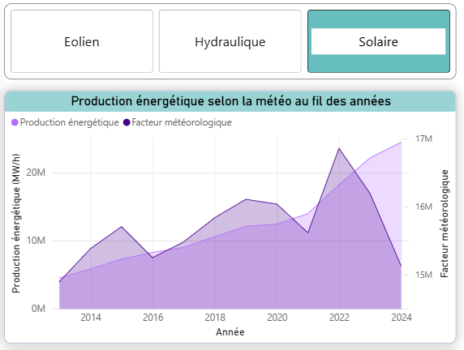

Sur le filtre Solaire, la production suit une **tendance haussière corrélée à l'ensoleillement moyen**, mais reflète surtout l'essor continu des installations photovoltaïques sur la période. Le double axe (production à gauche, facteur météo à droite) rend la corrélation entre conditions climatiques et rendement énergétique immédiatement lisible.

---

### Part des ENR avec filtre par filière

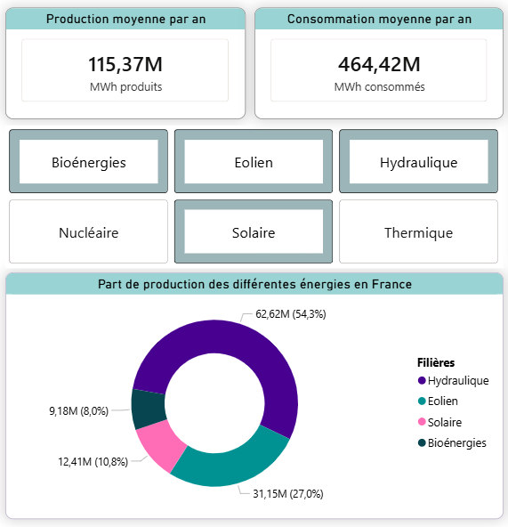

Ce graphique interactif affiche la répartition des ENR dans le mix selon la filière sélectionnée. Il permet d'identifier rapidement les filières sous-représentées et celles à fort potentiel de développement, selon le périmètre géographique ou temporel choisi.

---

## Outils & compétences mobilisés

Préparation des données — Python (VS Code)
Avant toute intégration dans Power BI, les fichiers sources (fichiers Excel individuels) ont été nettoyés et standardisés via un script Python utilisant pandas :

Rééchantillonnage temporel : agrégation des données de la demi-heure au pas horaire pour homogénéiser les séries
Suppression des doublons et des valeurs manquantes
Premier changement de type des colonnes (dates, numériques) pour fiabiliser la fusion en aval
Cette étape préalable a permis de simplifier et d'accélérer la fusion des fichiers dans Power BI Desktop

Modélisation & visualisation — Power BI Desktop

Power Query — fusion des fichiers nettoyés, transformations complémentaires
DAX — calcul des KPI, mesures dynamiques (taux de couverture, parts relatives, comparaisons inter-années)
Conception de tableau de bord — storytelling analytique, choix des visuels adaptés à chaque problématique, interactivité (filtres, slicers)

---

## 📬 Contact

N'hésitez pas à me contacter pour toute question sur ce projet ou pour échanger sur mon profil.
www.linkedin.com/in/eva-cortinovis-145b0a180
